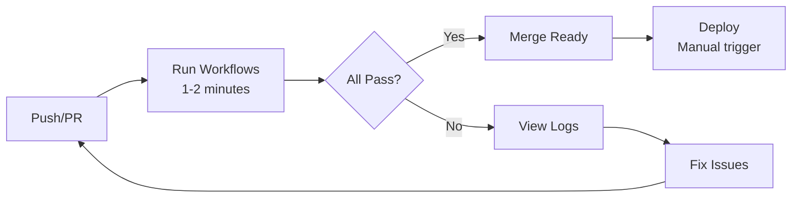

# CI/CD Quick Reference

This guide provides quick access to CI/CD commands, status checks, and troubleshooting.

## 🎯 Quick Commands

### Local Test Execution

```bash
# Smoke tests (instant feedback, no external dependencies)
python smoke_test.py

# Start API server for live testing
python -m uvicorn api.main:app --host 0.0.0.0 --port 8000

# Live tests (in another terminal with API running)
python live_test.py

# All tests (pytest)
pytest tests/ -v

# Security checks
python -m bandit -r . --skip B101,B601
python -m safety check
python -m flake8 . --max-line-length=100
python -m black --check .
python -m isort --check-only .
```

### GitHub Actions Monitoring

```bash
# View all workflow runs
gh action list

# View specific workflow runs
gh actions download -R username/treetalk-ai <workflow_id>

# Trigger workflow manually
gh workflow run tests.yml

# View workflow logs
gh run view <run_id> --log
```

---

## 📊 Status Dashboard

**Active Workflows:**
- ✅ Core Tests (`.github/workflows/tests.yml`)
- ✅ API Health (`.github/workflows/api-health.yml`)
- ✅ MVP Tests (`.github/workflows/mvp-tests.yml`)
- ✅ Live Tests (`.github/workflows/live-tests.yml`)
- ✅ Security (`.github/workflows/security.yml`)
- ✅ Documentation (`.github/workflows/docs.yml`)
- ✅ Deploy (`.github/workflows/deploy.yml`)

**Execution Timeline:**

```
On Push to main/develop:
├─ tests.yml (90-120s)
├─ mvp-tests.yml (60-90s)
│  └─ smoke-tests (10-15s)
│  └─ mvp-validation (50-75s)
├─ live-tests.yml (30-60s)
├─ security.yml (120-180s)
└─ docs.yml (30-60s)

Total: ~5-8 minutes (parallel execution)
```

**Daily/Weekly:**
- Daily (2 AM UTC): API Health Check
- Weekly: Security audit & dependency check

---

## 🔐 Environment Variables & Secrets

### Required GitHub Secrets

```yaml
GEMINI_API_KEY: <your-actual-gemini-api-key>
GITHUB_TOKEN: <auto-generated>
```

### CI Environment Variables

```bash
# Set in workflow .env file
GEMINI_API_KEY=test_key_for_ci
SERVER_HOST=0.0.0.0
SERVER_PORT=8000
```

### Local Development

```bash
# Create .env file
cat > .env << EOF
GEMINI_API_KEY=your_key_here
SERVER_HOST=127.0.0.1
SERVER_PORT=8000
EOF
```

---

## 🚨 Troubleshooting

### "API Server Failed to Start"

**Symptoms:** Live tests fail, server timeout errors

**Solutions:**
```yaml
# Increase wait time in live-tests.yml
max_attempts: 60  # Was 30, now 60
sleep_interval: 1  # Check every 1 second total 60s

# Kill any existing processes
pkill -f "uvicorn api.main:app"

# Test locally
python -m uvicorn api.main:app
# Should show: Uvicorn running on http://0.0.0.0:8000
```

### "Gemini API Timeout"

**Symptoms:** Live tests hang on /analyze requests

**Solutions:**
```python
# Add timeout to requests
httpx.AsyncClient(timeout=30.0)

# Use circuit breaker pattern
# Retry failed requests with exponential backoff

# Check API key validity
curl -H "Authorization: Bearer $GEMINI_API_KEY" \
  https://generativelanguage.googleapis.com/v1beta/models/list
```

### "Port Already in Use"

**Symptoms:** Address already in use error

**Solutions:**
```bash
# Find and kill process using port 8000
lsof -i :8000
kill -9 <PID>

# Or use different port
python -m uvicorn api.main:app --port 8001
```

### "Import Errors in CI"

**Symptoms:** ModuleNotFoundError, ImportError

**Solutions:**
```bash
# Ensure requirements.txt is up to date
pip freeze > requirements.txt

# Run locally first
python -c "import fastapi, pydantic, google.generativeai"

# Check Python version compatibility
python --version  # Should be 3.9+
```

### "Workflow File Syntax Error"

**Symptoms:** Error parsing .github/workflows/file.yml

**Solutions:**
```bash
# Validate YAML syntax
python -m yaml .github/workflows/file.yml

# Use GitHub's workflow validator
# https://github.com/actions/stub

# Check for tabs (must be spaces)
cat -A .github/workflows/file.yml | grep "^I"  # Should be empty
```

---

## 📈 Performance Optimization

### Parallel Execution

**Current:** All workflows run in parallel
```yaml
on:
  push:
    branches: [main, develop]
  pull_request:
    branches: [main, develop]
```

**Optimization:** Cache dependencies
```yaml
- uses: actions/setup-python@v4
  with:
    cache: 'pip'  # Caches pip dependencies
```

### Test Speed Improvements

```python
# Use pytest-xdist for parallel test execution
pytest -n auto  # Use all CPU cores

# Reduce timeout for CI
timeout=5  # vs 30 in local

# Skip slow tests in CI
pytest -m "not slow"
```

### Workflow Speed

```yaml
# Use smaller Python versions where possible
strategy:
  matrix:
    python-version: ['3.11']  # Test single version in CI

# Use caching
- uses: actions/cache@v3
  with:
    path: ~/.cache/pip
    key: ${{ runner.os }}-pip-${{ hashFiles('**/requirements.txt') }}
```

---

## 📋 Pre-Commit Checklist

Before pushing to main:

- [ ] Smoke tests pass locally: `python smoke_test.py`
- [ ] API starts without errors: `python -m uvicorn api.main:app`
- [ ] Live tests pass: `python live_test.py`
- [ ] Security checks pass: `bandit -r . && safety check`
- [ ] Code formatted: `black . && isort .`
- [ ] Tests pass: `pytest tests/ -v`
- [ ] No secrets in code: `git log -p | grep -i "api_key\|password"`
- [ ] Documentation updated: Check CHANGELOG, README, docs
- [ ] Version bumped: `__version__` updated if release
- [ ] Git status clean: `git status` should show nothing

---

## 🔄 Continuous Integration Flow



---

## 📞 Support

### Getting Help

1. **Check Logs:** Click workflow → Click failed job → View logs
2. **Common Issues:** See troubleshooting section above
3. **Documentation:** See [WORKFLOWS.md](WORKFLOWS.md) for detailed info
4. **GitHub Issues:** Report bugs and request features

### Useful Links

- [GitHub Actions Documentation](https://docs.github.com/en/actions)
- [PyTest Documentation](https://docs.pytest.org/)
- [Bandit Security Guide](https://bandit.readthedocs.io/)
- [Black Code Formatter](https://github.com/psf/black)
- [FastAPI Testing Guide](https://fastapi.tiangolo.com/advanced/testing-dependencies/)

---

## 📝 Example Workflow Runs

### Successful Run (All Tests Pass)
```
✅ tests.yml:75 passed in 2.45s
✅ mvp-tests.yml: 50 passed in 1.23s
✅ live-tests.yml: 30 passed in 0.89s
✅ security.yml: All checks passed
✅ docs.yml: All validations passed

Total: 155 tests passed in ~5 minutes
```

### Failed Run (Example)
```
❌ live-tests.yml: Start API server
  Error: Port 8000 already in use

💡 Solution:
  pkill -f "uvicorn api.main:app"
  Retry workflow

Re-run: ✅ All tests now pass
```

---

## 🎓 Learning Resources

- [GitHub Actions Best Practices](https://docs.github.com/en/actions/security-guides)
- [Testing Python Applications](https://docs.pytest.org/en/latest/)
- [Security Testing for Python](https://bandit.readthedocs.io/)
- [Code Quality Tools](https://flake8.pycqa.org/)
